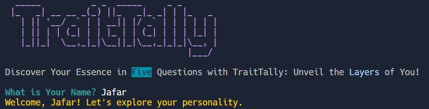

# TraitTally Personality Test

TraitTally is a Command Line Interface (CLI) based personality test that explores your essence through five engaging questions.

## Live Demo

Try TraitTally now on REPL.it: 

## Screenshots

## Features

- Dynamic and interactive questions
- Colorful console output for an engaging experience
- Personalized messages based on the user's responses

## Getting Started

1. Clone the repository.
2. Install dependencies: `npm install`.
3. Run the application: `npm start`.

## Usage

- Follow the on-screen instructions to answer personality questions.
- Discover your personality result based on your responses.

## Contributing

Contributions are welcome! Fork the repository and submit a pull request.

## License

This project is licensed under the MIT License - see the [LICENSE](LICENSE) file for details.
